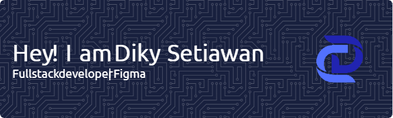

# Hello, fellow coder! 👋

  

  <h3>Welcome to my creative corner—where innovation meets code.</h3>
  
Dive in, get inspired, and let's build something extraordinary together!

  
  

 

## 🚀 Tech Stack

  
<h3>Frontend Technologies</h3>
  

  
  
  
  
  
  

<h3>Frameworks & Libraries</h3>

  
  
  
  
  

<h3>Backend Technologies</h3>

  
  
  
  

 

## 📊 GitHub Stats

  

 

## 🌐 Connect With Me

  
  
  
  
  
  

 

  

---

  
<em>💡 Open to collaborations and exciting projects!</em>

  
⚡ Fun fact: I love turning ideas into reality through code

